# Roadmap: Learn to Build AI Agents with LangGraph

This comprehensive learning roadmap is designed for developers who know Python fundamentals and want to master AI agent development using LangChain and LangGraph. Each stage builds upon the previous one, with clear learning outcomes, hands-on exercises, and real-world applications.

---

## How to Use This Roadmap

1. **Follow the stages in order** — each stage builds on concepts from previous ones
2. **Complete all exercises** — hands-on practice is essential for mastery
3. **Build the mini-projects** — applying concepts solidifies understanding
4. **Review concepts regularly** — agent development involves many interconnected ideas
5. **Experiment in playground/** — use the playground notebooks to test ideas quickly

**Estimated Total Time:** 4-6 weeks of focused, part-time study (10-15 hours/week)

---

## Stage 0 — Foundations: Understanding LLMs & Basic Interactions (1-2 days)

### 🎯 Learning Objectives
By the end of this stage, you will:
- Understand what Large Language Models (LLMs) are and how they work
- Know how to make programmatic API calls to LLMs
- Understand prompt engineering basics (system/user messages, few-shot learning)
- Be able to handle LLM responses and errors gracefully
- Understand token limits, costs, and rate limiting

### 📚 Prerequisites
- Basic Python knowledge (variables, functions, dictionaries, lists)
- Understanding of API calls and HTTP requests
- Familiarity with JSON data structures

### 📖 Study Materials
- **Primary:** [`playground/01_basics_overview.ipynb`](../playground/01_basics_overview.ipynb)
- **Supplement:** LangChain documentation on Chat Models

### ✅ Key Concepts
- **LLM fundamentals:** Tokens, context windows, temperature, top_p
- **Prompt structure:** System messages vs user messages
- **Few-shot learning:** Providing examples to guide the model
- **Response handling:** Parsing, error handling, retries
- **Memory basics:** Keeping conversation context

### 🛠️ Hands-On Tasks
1. Read and run `playground/01_basics_overview.ipynb` completely
2. Experiment with different system prompts to change model behavior
3. Implement a simple conversation loop with memory
4. Try different temperature settings and observe output differences
5. Handle API errors gracefully with try/except blocks

### 🏆 Mini-Project
**Build a Simple Chatbot:** Create a chatbot that remembers the last 5 messages and can answer questions about a specific topic (e.g., Python programming, cooking recipes). Test with various conversation flows.

### ✓ Stage Completion Checklist
- [ ] Can explain what tokens are and why they matter
- [ ] Can write effective system and user prompts
- [ ] Can implement basic conversation memory
- [ ] Can handle API errors and rate limits
- [ ] Successfully completed the mini-project

---

## Stage 1 — Simple Agents & Tool Integration (2-3 days)

### 🎯 Learning Objectives
By the end of this stage, you will:
- Understand what an "agent" is and how it differs from a simple LLM call
- Know how to define and implement tools that LLMs can use
- Understand agent loops and decision-making patterns
- Be able to route requests to appropriate tools based on user input
- Implement proper error handling for tool execution

### 📚 Prerequisites
- Completed Stage 0
- Understanding of Python functions and decorators
- Basic knowledge of JSON schemas

### 📖 Study Materials
- **Primary:** [`playground/02_code_examples.ipynb`](../playground/02_code_examples.ipynb)
- **Demos:** [`notebooks/L1_demo_02_function_calling.ipynb`](../notebooks/L1_demo_02_function_calling.ipynb)

### ✅ Key Concepts
- **Agent definition:** LLM + tools + decision-making logic
- **Tool patterns:** How to define tool schemas and implementations
- **Agent loops:** Observe → Reason → Act → Repeat
- **Tool calling:** How LLMs request tool usage
- **Dispatching:** Routing tool calls to the correct implementation
- **State management:** Tracking what the agent has done

### 🛠️ Hands-On Tasks
1. Read and run `playground/02_code_examples.ipynb` completely
2. Create 3 custom tools (e.g., calculator, weather lookup, web search stub)
3. Implement a simple dispatcher that routes tool calls
4. Add logging to track agent decisions
5. Handle cases where tools fail or return errors

### 🏆 Mini-Project
**Build a Task Assistant:** Create an agent that can help with daily tasks using tools like:
- `get_current_time()` — returns current date/time
- `set_reminder(message, time)` — simulates setting a reminder
- `calculate(expression)` — evaluates math expressions
- `search_web(query)` — stub that returns mock search results

### ✓ Stage Completion Checklist
- [ ] Can explain the difference between an LLM and an agent
- [ ] Can define tool schemas with proper types
- [ ] Can implement tool dispatching logic
- [ ] Can debug agent decision-making
- [ ] Successfully completed the mini-project

---

## Stage 2 — LangChain Fundamentals (3-4 days)

### 🎯 Learning Objectives
By the end of this stage, you will:
- Understand LangChain's architecture and core abstractions
- Know how to use ChatModels, PromptTemplates, and OutputParsers
- Be able to chain multiple components together
- Understand LCEL (LangChain Expression Language)
- Know how to use LangChain's built-in tools and utilities

### 📚 Prerequisites
- Completed Stages 0-1
- Familiarity with Python classes and object-oriented programming
- Understanding of pipeline/chain concepts

### 📖 Study Materials
- **Primary:** [`notebooks/L2_demo_01_langchain_101.ipynb`](../notebooks/L2_demo_01_langchain_101.ipynb)
- **Deep Dive:** [`notebooks/L2_demo_04_LCEL.ipynb`](../notebooks/L2_demo_04_LCEL.ipynb)
- **Streaming:** [`notebooks/L2_demo_02_streaming.ipynb`](../notebooks/L2_demo_02_streaming.ipynb)

### ✅ Key Concepts
- **ChatModels:** Unified interface for different LLM providers
- **PromptTemplates:** Reusable prompt structures with variables
- **OutputParsers:** Converting LLM text into structured data
- **Chains:** Connecting multiple steps in a pipeline
- **LCEL:** The `|` operator for chaining components
- **Runnables:** The base interface for LangChain components
- **Streaming:** Getting responses token-by-token

### 🛠️ Hands-On Tasks
1. Work through `L2_demo_01_langchain_101.ipynb` completely
2. Create custom PromptTemplates for different use cases
3. Build a chain that uses 3+ components
4. Implement streaming to show real-time responses
5. Use LCEL syntax to simplify your chains

### 🏆 Mini-Project
**Build a Document Q&A System:** Create a system that:
1. Takes a document (text)
2. Allows users to ask questions about it
3. Uses a chain to: extract relevant sections → format prompt → generate answer
4. Streams the response token-by-token
5. Parses the answer into structured format (answer + confidence score)

### ✓ Stage Completion Checklist
- [ ] Can explain LangChain's core abstractions
- [ ] Can build chains using LCEL syntax
- [ ] Can implement streaming responses
- [ ] Can create custom PromptTemplates and OutputParsers
- [ ] Successfully completed the mini-project

---

## Stage 3 — Advanced Agents: ReAct Pattern & Tool Calling (4-6 days)

### 🎯 Learning Objectives
By the end of this stage, you will:
- Understand the ReAct (Reasoning + Acting) pattern
- Know how to implement multi-step reasoning
- Be able to create complex tool ecosystems
- Understand agent planning and self-reflection
- Know how to debug and trace agent behavior

### 📚 Prerequisites
- Completed Stages 0-2
- Understanding of control flow and state machines
- Familiarity with debugging techniques

### 📖 Study Materials
- **Primary:** [`notebooks/L1_demo_03_react.ipynb`](../notebooks/L1_demo_03_react.ipynb)
- **Tools:** [`notebooks/L2_demo_06_tools.ipynb`](../notebooks/L2_demo_06_tools.ipynb)
- **Agent:** [`notebooks/L2_demo_07_agent.ipynb`](../notebooks/L2_demo_07_agent.ipynb)
- **Exercises:** Solution exercises in L1 folder

### ✅ Key Concepts
- **ReAct pattern:** Thought → Action → Observation loop
- **Multi-step reasoning:** Breaking down complex tasks
- **Tool orchestration:** Using multiple tools together
- **Agent planning:** Deciding which tools to use and when
- **Self-reflection:** Agents evaluating their own outputs
- **Agent traces:** Debugging what the agent is thinking

### 🛠️ Hands-On Tasks
1. Study `L1_demo_03_react.ipynb` and understand ReAct loop
2. Implement self-reflection (agent checks its own work)
3. Create a tool ecosystem with 5+ interconnected tools
4. Add detailed logging to trace agent reasoning
5. Handle edge cases (tool failures, infinite loops, etc.)

### 🏆 Mini-Project
**Build a Research Assistant:** Create an agent that:
1. Takes a research question
2. Plans which tools to use (web search, calculator, document lookup)
3. Executes tools in sequence based on previous results
4. Reflects on whether it has enough information
5. Synthesizes a final answer with citations
6. Logs all reasoning steps for debugging

### ✓ Stage Completion Checklist
- [ ] Can explain the ReAct pattern and its benefits
- [ ] Can implement multi-step reasoning
- [ ] Can create interconnected tool ecosystems
- [ ] Can trace and debug agent behavior
- [ ] Successfully completed the mini-project

Knowledge Base Agents & Reliability

- **Goal:** Build agents that use a knowledge base (KB) for accurate, up-to-date answers while remaining resilient to missing or stale data.
- **Design patterns:** Retrieval-Augmented Generation (RAG) with separation between retrieval and generation; retrieval scoring + reranking; fallback to safe responses when confidence is low.
- **KB preparation:** Chunk documents (512–2,048 tokens), include metadata (source, date, type), and normalize text (cleaning, de-duplication).
- **Embeddings & vector store:** Choose embeddings that match your domain; store vectors with metadata and use vector stores that support metadata filtering and efficient nearest-neighbor search.
- **Retrieval quality:** Use hybrid retrieval (BM25 + embeddings) for better recall; rerank top-k candidates using a cross-encoder or re-ranker.
- **Freshness & updates:** Implement an ingestion pipeline with incremental updates, content versioning, and last-updated timestamps. Add TTL or periodic re-embedding for frequently changing content.
- **Context windows & chunking:** Limit retrieved context by token budget; prefer smaller, relevant chunks with overlap; add provenance snippets for transparency.
- **Safety & hallucination mitigation:** Add explicit grounding prompts, include provenance citations in responses, and validate generated statements against retrieved sources when possible.
- **Caching & latency:** Cache retrieval results for repeated queries, use async loaders for large ingestion, and add circuit-breaker logic for downstream timeouts.
- **Observability & diagnostics:** Log retrieval traces, model token usage, latencies, and a retrieval confidence score. Capture diagnostic strings from the LLM SDK for failed/slow calls.
- **Testing & metrics:** Track end-to-end metrics: MRR/Recall@k for retrieval, factuality score, user-facing accuracy, latency, and cost (tokens/RUs). Build unit tests for ingestion and integration tests for end-to-end RAG flows.
- **Deployment & secrets:** Keep Foundry/API keys in `.env` (or CI secrets). Use rate-limit retries and region preferences, and enforce least-privilege access for KB stores.
- **Next steps (playground):**
  - Create a `playground/03_rag_kb.ipynb` that ingests a small sample KB, builds embeddings, runs retrieval, and shows provenance in responses.
  - Add a test harness in `scripts/` to validate retrieval quality after each KB update.

---

## Stage 4 — LangGraph: Building Stateful Workflows (4-6 days)

### 🎯 Learning Objectives
By the end of this stage, you will:
- Understand LangGraph's graph-based workflow paradigm
- Know how to define nodes, edges, and conditional routing
- Be able to implement stateful workflows with persistent state
- Understand reducers and state management patterns
- Know how to use checkpoints for debugging and recovery

### 📚 Prerequisites
- Completed Stages 0-3
- Understanding of graph theory basics (nodes and edges)
- Familiarity with state machines and workflow patterns

### 📖 Study Materials
- **Primary:** All L3 notebooks (`L3_demo_01` through `L3_demo_08`)
- **Start here:** [`notebooks/L3_demo_01_langgraph_workflow.ipynb`](../notebooks/L3_demo_01_langgraph_workflow.ipynb)
- **State management:** [`notebooks/L3_demo_02_schemas.ipynb`](../notebooks/L3_demo_02_schemas.ipynb)
- **Checkpoints:** [`notebooks/L3_demo_08_checkpoints.ipynb`](../notebooks/L3_demo_08_checkpoints.ipynb)

### ✅ Key Concepts
- **Graphs:** Nodes (functions) and edges (routing logic)
- **State schemas:** Defining what data flows through the graph
- **Reducers:** How to merge/update state at each node
- **Conditional edges:** Dynamic routing based on state
- **Checkpoints:** Saving workflow state for debugging/recovery
- **Subgraphs:** Composing complex workflows from simpler ones
- **Config:** Parameterizing workflows for different scenarios

### 🛠️ Hands-On Tasks
1. Work through all L3 demo notebooks sequentially
2. Build a simple graph with 3 nodes and conditional routing
3. Implement custom reducers for different state update patterns
4. Add checkpointing to save workflow state
5. Create a workflow that handles errors gracefully
6. Visualize your graph using LangGraph's visualization tools

### 🏆 Mini-Project
**Build a Customer Support Workflow:** Create a LangGraph workflow that:
1. **Intake node:** Classifies customer request (billing, technical, general)
2. **Routing:** Conditionally routes to appropriate handler based on classification
3. **Handler nodes:** Different logic for each request type
4. **Escalation node:** Detects if issue needs human intervention
5. **Response node:** Formats final response
6. **State:** Tracks conversation history, classification confidence, escalation flags
7. **Checkpoints:** Saves state after each node for debugging

### ✓ Stage Completion Checklist
- [ ] Can design and implement graph-based workflows
- [ ] Can define state schemas and use reducers effectively
- [ ] Can implement conditional routing logic
- [ ] Can use checkpoints for debugging
- [ ] Successfully completed the mini-project

---

## Stage 5 — Retrieval-Augmented Generation (RAG) (3-5 days)

### 🎯 Learning Objectives
By the end of this stage, you will:
- Understand what RAG is and why it's essential for AI agents
- Know how to create and use embeddings for semantic search
- Be able to build vector stores (Chroma, FAISS)
- Understand chunking strategies and metadata management
- Know how to implement hybrid search (keyword + semantic)
- Be able to evaluate retrieval quality

### 📚 Prerequisites
- Completed Stages 0-4
- Basic understanding of vectors and similarity measures
- Familiarity with databases and indexing concepts

### 📖 Study Materials
- **Primary:** [`playground/03_rag_kb.ipynb`](../playground/03_rag_kb.ipynb) — **Start here!**
- **LangChain RAG:** [`notebooks/L2_demo_05_RAG.ipynb`](../notebooks/L2_demo_05_RAG.ipynb)
- **Advanced:** L4 RAG notebooks for production patterns

### ✅ Key Concepts
- **RAG architecture:** Retrieval → Augmentation → Generation
- **Embeddings:** Converting text to vectors for semantic similarity
- **Vector stores:** Chroma, FAISS, Pinecone, etc.
- **Chunking:** Breaking documents into retrievable pieces
- **Metadata filtering:** Combining semantic search with filters
- **Reranking:** Improving retrieval quality with cross-encoders
- **Provenance:** Tracking where information comes from
- **Hybrid search:** BM25 + embeddings for better recall

### 🛠️ Hands-On Tasks
1. **Start with:** `playground/03_rag_kb.ipynb` — complete educational walkthrough
2. Work through `L2_demo_05_RAG.ipynb` to see LangChain's RAG tools
3. Build your own knowledge base with 20+ documents
4. Experiment with different chunking strategies (512, 1024, 2048 tokens)
5. Implement metadata filtering (by date, source, type)
6. Add provenance/citations to generated responses
7. Measure retrieval quality (precision, recall)

### 🏆 Mini-Project
**Build a Technical Documentation Assistant:** Create a RAG system that:
1. **Ingests:** Python/LangChain documentation (at least 50 pages)
2. **Chunks:** Intelligently splits documents with overlap
3. **Embeds:** Creates semantic embeddings using sentence-transformers
4. **Stores:** Saves vectors in Chroma or FAISS with metadata
5. **Retrieves:** Finds relevant docs using hybrid search
6. **Generates:** Answers questions with citations
7. **Evaluates:** Measures answer quality and retrieval accuracy

### ✓ Stage Completion Checklist
- [ ] Can explain RAG architecture and benefits
- [ ] Can build and query vector stores
- [ ] Can implement effective chunking strategies
- [ ] Can add provenance to generated responses
- [ ] Can evaluate retrieval quality
- [ ] Successfully completed the mini-project

---

## Stage 6 — Production Readiness & Best Practices (ongoing)

### 🎯 Learning Objectives
By the end of this stage, you will:
- Understand production deployment considerations
- Know how to implement observability and monitoring
- Be able to handle errors, retries, and rate limits
- Understand cost optimization strategies
- Know security best practices for AI agents
- Be able to evaluate and improve agent performance

### 📚 Prerequisites
- Completed Stages 0-5
- Understanding of production systems and DevOps basics
- Familiarity with logging, monitoring, and security concepts

### 📖 Study Materials
- **Evaluation:** L4 notebooks on RAGAS and evaluation
- **Security:** Azure best practices documentation
- **Monitoring:** MLflow and observability patterns

### ✅ Key Concepts
- **Observability:** Logging, tracing, metrics
- **Error handling:** Retries, exponential backoff, circuit breakers
- **Rate limiting:** Handling 429 errors, token bucket algorithms
- **Cost management:** Token counting, caching, budget alerts
- **Security:** Secret management, API key rotation, input validation
- **Evaluation:** Precision, recall, latency, cost metrics
- **Testing:** Unit tests, integration tests, end-to-end tests
- **Deployment:** Containerization, CI/CD, blue-green deployments

### 🛠️ Hands-On Tasks
1. Add comprehensive logging to an existing agent
2. Implement retry logic with exponential backoff
3. Add token counting and cost tracking
4. Implement input validation and sanitization
5. Set up evaluation metrics (RAGAS or custom)
6. Create unit tests for your tools and workflows
7. Containerize an agent application

### 🏆 Mini-Project
**Production-Ready Support Agent:** Take any previous mini-project and enhance it with:
1. **Observability:** Structured logging, trace IDs, latency tracking
2. **Error handling:** Graceful degradation, retry logic, fallbacks
3. **Rate limiting:** Token bucket, queue management
4. **Cost tracking:** Token usage, API call counts, cost per query
5. **Security:** Environment variables, input validation, output sanitization
6. **Evaluation:** Automated tests, quality metrics, A/B testing
7. **Deployment:** Docker container, health checks, CI/CD pipeline

### ✓ Stage Completion Checklist
- [ ] Can implement comprehensive observability
- [ ] Can handle errors and rate limits gracefully
- [ ] Can track and optimize costs
- [ ] Can secure agents following best practices
- [ ] Can evaluate agent performance systematically
- [ ] Successfully completed the mini-project

---

## 🎓 Learning Tips & Best Practices

### Study Strategies
- **Don't skip stages:** Each builds on the previous one
- **Code along:** Type out examples yourself, don't just read
- **Break when stuck:** If confused, take a break and return with fresh eyes
- **Experiment constantly:** Modify examples to see what happens
- **Keep a learning journal:** Document "aha!" moments and confusions
- **Build progressively:** Start simple, add complexity gradually

### Development Workflow
- **Use playground/ for experiments:** Test ideas in small notebooks first
- **Keep .env secure:** Never commit secrets, use `.env.example` as template
- **Start with stubs:** Mock external APIs before wiring real ones
- **Version control everything:** Commit working code frequently
- **Document your code:** Future you will thank present you
- **Test incrementally:** Validate each component before integration

### Debugging Tips
- **Add logging early:** Use print statements and structured logs
- **Check traces:** LangChain/LangGraph provide execution traces
- **Isolate components:** Test tools and chains independently
- **Validate schemas:** Ensure state/tool schemas match expectations
- **Read error messages carefully:** They usually tell you exactly what's wrong
- **Use checkpoints:** LangGraph checkpoints help debug workflow state

### Cost Management
- **Use smaller models for testing:** GPT-3.5-turbo is cheaper than GPT-4
- **Limit context length:** Only send necessary tokens
- **Cache responses:** Store answers to repeated questions
- **Set budget alerts:** Monitor API usage in real-time
- **Use local models for dev:** Consider Ollama for zero-cost testing

### Community Resources
- **LangChain Discord:** Active community for questions
- **GitHub Issues:** Check existing issues before asking
- **Documentation:** LangChain and LangGraph docs are comprehensive
- **YouTube tutorials:** Many practical walkthroughs available
- **Twitter/X:** Follow @LangChainAI for updates

---

## 📚 Recommended Reading Order

### For Visual Learners
1. Read this roadmap completely first
2. Check the flow diagram below
3. Scan `notebook_reference.md` to see all available materials
4. Start with `playground/01_basics_overview.ipynb`
5. Progress through stages sequentially

### For Hands-On Learners
1. Skim this roadmap
2. Jump directly to `playground/01_basics_overview.ipynb`
3. Code along with every example
4. Refer back to roadmap when stuck
5. Complete mini-projects before moving to next stage

### For Theory-First Learners
1. Read this entire roadmap
2. Read all Key Concepts sections in order
3. Review LangChain/LangGraph documentation
4. Then start with notebooks
5. Reference concepts while coding

---

## 🗺️ Visual Learning Path

---

## ⚙️ Environment Setup

### Microsoft Foundry Configuration

Microsoft Foundry (formerly Azure AI Foundry) provides hosted LLM access. Here's how to set it up:

#### Creating Your .env File

Create a `.env` file in the project root with these keys:

```bash
# Microsoft Foundry Configuration
FOUNDRY_PROJECT_ENDPOINT=https://your-project.inference.ai.azure.com
FOUNDRY_PROJECT_REGION=westus
FOUNDRY_DEPLOYMENT_NAME=gpt-4-turbo
FOUNDRY_API_KEY=your-secret-api-key-here

# Optional: OpenAI Direct Access
OPENAI_API_KEY=your-openai-key-here
```

**⚠️ CRITICAL:** Never commit `.env` to git! It's already in `.gitignore`.

#### Using Secrets in Notebooks

```python
from dotenv import load_dotenv
import os

# Load environment variables
load_dotenv()

# Access secrets
endpoint = os.getenv("FOUNDRY_PROJECT_ENDPOINT")
api_key = os.getenv("FOUNDRY_API_KEY")

# Use with LangChain
from langchain_openai import AzureChatOpenAI

llm = AzureChatOpenAI(
    azure_endpoint=endpoint,
    api_key=api_key,
    api_version="2024-02-15-preview",
    deployment_name=os.getenv("FOUNDRY_DEPLOYMENT_NAME")
)
```

#### Security Best Practices
- ✅ Keep `.env` in `.gitignore`
- ✅ Use `.env.example` with placeholder values for documentation
- ✅ Rotate API keys regularly
- ✅ Use environment-specific `.env` files (`.env.dev`, `.env.prod`)
- ✅ Never hardcode secrets in notebooks or scripts
- ❌ Never commit `.env` to version control
- ❌ Never share API keys in chat logs or screenshots
- ❌ Never paste secrets into shared notebooks

### Alternative: Local Models with Ollama

For zero-cost development and testing:

```bash
# Install Ollama (https://ollama.ai)
# Pull a model
ollama pull llama2

# Use in notebooks
from langchain_community.llms import Ollama
llm = Ollama(model="llama2")
```

---

## 📊 Visual Learning Flow Diagram

The flow diagram below shows your complete learning journey from fundamentals to production-ready agents.

```mermaid
flowchart TD
    Start([🚀 Start Learning]) --> Stage0[Stage 0: LLM Foundations<br/>1-2 days]
    Stage0 --> Stage1[Stage 1: Simple Agents & Tools<br/>2-3 days]
    Stage1 --> Stage2[Stage 2: LangChain Basics<br/>3-4 days]
    Stage2 --> Stage3[Stage 3: ReAct & Tool Calling<br/>4-6 days]
    Stage3 --> Stage4[Stage 4: LangGraph Workflows<br/>4-6 days]
    Stage4 --> Stage5[Stage 5: RAG Systems<br/>3-5 days]
    Stage5 --> Stage6[Stage 6: Production Readiness<br/>Ongoing]
    
    Stage0 --> Check0{Mini-Project<br/>Complete?}
    Check0 -- Yes --> Stage1
    Check0 -- No --> Practice0[Practice & Review]
    Practice0 --> Stage0
    
    Stage2 --> Check2{Understand<br/>Chains?}
    Check2 -- Yes --> Stage3
    Check2 -- No --> Practice2[Re-read LCEL<br/>Build More Chains]
    Practice2 --> Stage2
    
    Stage4 --> Check4{Can Build<br/>Workflows?}
    Check4 -- Yes --> Stage5
    Check4 -- No --> Practice4[Practice Graphs<br/>Add Checkpoints]
    Practice4 --> Stage4
    
    Stage6 --> Advanced[🎓 Advanced Topics]
    Advanced --> A1[Multi-Agent Systems]
    Advanced --> A2[Human-in-the-Loop]
    Advanced --> A3[Agent Evaluation]
    Advanced --> A4[Custom Tools & APIs]
    
    Stage6 --> Final([🏆 Ready to Build<br/>Production Agents!])
    
    style Start fill:#4CAF50,color:#fff
    style Final fill:#2196F3,color:#fff
    style Stage0 fill:#E3F2FD
    style Stage1 fill:#E3F2FD
    style Stage2 fill:#FFF3E0
    style Stage3 fill:#FFF3E0
    style Stage4 fill:#F3E5F5
    style Stage5 fill:#F3E5F5
    style Stage6 fill:#E8F5E9
    style Advanced fill:#FFE0B2
```



---

## 🎯 Advanced Topics (After Completing Stages 0-6)

Once you've mastered the fundamentals, explore these advanced topics:

### Multi-Agent Systems
Learn how to coordinate multiple AI agents working together:
- **Agent roles:** Manager, worker, reviewer agents
- **Communication protocols:** How agents share information
- **Task delegation:** Breaking complex work across agents
- **Conflict resolution:** Handling disagreements between agents

**Resources:**
- [`notebooks/L1_demo_04_multi_agents.ipynb`](../notebooks/L1_demo_04_multi_agents.ipynb)
- LangGraph multi-agent documentation

### Human-in-the-Loop (HITL) Patterns
Learn when and how to involve humans in agent workflows:
- **Approval gates:** Requiring human confirmation for critical actions
- **Escalation logic:** Detecting when human expertise is needed
- **Feedback loops:** Learning from human corrections
- **UI/UX considerations:** Building interfaces for HITL

### Agent Evaluation & Testing
Systematically measure and improve agent performance:
- **Evaluation frameworks:** RAGAS, custom metrics
- **Test datasets:** Creating representative test cases
- **A/B testing:** Comparing different agent configurations
- **Regression testing:** Ensuring changes don't break existing functionality

### Custom Tools & API Integration
Build sophisticated tool ecosystems:
- **API wrappers:** Creating LangChain tools from REST APIs
- **Error handling:** Graceful degradation when tools fail
- **Rate limiting:** Managing API quotas and costs
- **Authentication:** Secure token management for tools

### Database Integration & Text2SQL
Enable agents to query structured data:
- **SQL generation:** Converting natural language to SQL
- **Query validation:** Ensuring safe SQL execution
- **Result formatting:** Presenting data clearly
- **Multi-database support:** Working with different database engines

**Resources:**
- [`notebooks/L3_demo_05_database_toolkit.ipynb`](../notebooks/L3_demo_05_database_toolkit.ipynb)
- [`notebooks/L3_solution_exercise_02_text2sql.ipynb`](../notebooks/L3_solution_exercise_02_text2sql.ipynb)

---

## 🐛 Troubleshooting Common Issues

### "No .env file found" Error

If you see: `No .env file found at C:\Training\Udacity\AI_Agents_LangGraph\playground\.env`

**Solution:** Create `.env` at the project root, not in `playground/`:

```powershell
# From project root
New-Item -Path .\.env -ItemType File -Force
Add-Content .\.env "FOUNDRY_PROJECT_ENDPOINT=https://your-foundry.example"
Add-Content .\.env "FOUNDRY_API_KEY=your-key-here"
```

The notebooks use an upward-searching loader that will find `.env` in the project root.

### Import Errors

If you see `ModuleNotFoundError`:

```powershell
# Activate virtual environment
.\.venv\Scripts\Activate.ps1

# Install dependencies
pip install langchain langchain-openai python-dotenv

# For specific notebooks
pip install chromadb  # For RAG notebooks
pip install sentence-transformers  # For embeddings
```

### Rate Limit Errors (429)

If you hit API rate limits:
1. Add exponential backoff retry logic
2. Use caching for repeated queries
3. Switch to smaller/cheaper models for testing
4. Consider local models (Ollama) for development

### Notebook Kernel Issues

If notebooks won't run:
1. Ensure `.venv` is activated
2. Select the correct Python interpreter in VS Code
3. Restart the Jupyter kernel
4. Clear outputs and run from top

---

## 📈 Tracking Your Progress

### Weekly Check-ins

At the end of each week, ask yourself:
- [ ] What concepts did I learn this week?
- [ ] What mini-project did I complete?
- [ ] What am I still confused about?
- [ ] What should I review before moving forward?
- [ ] Did I commit my work to git?

### Monthly Milestones

- **Month 1:** Complete Stages 0-3, comfortable with agents and tools
- **Month 2:** Complete Stages 4-5, can build RAG systems and workflows
- **Month 3:** Complete Stage 6, ready for production deployments

### Success Indicators

You're ready to move on when you can:
- ✅ Explain concepts to someone else
- ✅ Build examples without looking at references
- ✅ Debug issues independently
- ✅ Modify examples creatively
- ✅ Complete mini-projects confidently

---

## 🎉 What's Next After Completion?

### Build Your Portfolio
1. **Personal Projects:** Build agents that solve real problems for you
2. **Open Source:** Contribute to LangChain/LangGraph
3. **Blog Posts:** Write about what you learned
4. **GitHub Repos:** Share your mini-projects publicly

### Career Opportunities
- AI/ML Engineer specializing in LLM applications
- Agent Developer for enterprise systems
- Technical Consultant for AI integration
- AI Product Manager understanding implementation
- Research Engineer in agent architectures

### Stay Current
- Follow LangChain releases and blog posts
- Join the LangChain Discord community
- Attend AI/ML conferences and meetups
- Experiment with new models and techniques
- Read papers on agent architectures

---

## 📞 Getting Help

### When You're Stuck
1. **Read error messages carefully** — they usually tell you what's wrong
2. **Check the notebook reference** — examples might already exist
3. **Review the specific concept** in Key Concepts sections
4. **Search LangChain docs** — comprehensive documentation available
5. **Ask in communities** — Discord, StackOverflow, GitHub Issues

### Good Questions Include
- What you're trying to accomplish
- What you've tried so far
- The specific error message
- Minimal code to reproduce the issue
- Your environment details (Python version, package versions)

---

Note about `.env` loader and missing file

- If a notebook prints: `No .env file found at C:\\Training\\Udacity\\AI_Agents_LangGraph\\playground\\.env`, that means the loader attempted to read a `.env` file in the current working directory (the `playground/` folder) and didn't find one. The loader in `playground/01_basics_overview.ipynb` looks for a `.env` file at the notebook's working directory by default.
- Recommended: create the `.env` file at the project root (C:\\Training\\Udacity\\AI_Agents_LangGraph\\.env) rather than inside `playground/`. The loader will read that file when notebooks are executed from the project root or when you pass the full path to the loader.

Quick example to create a safe local `.env` at the project root (PowerShell):

```powershell
# Run from project root
echo "FOUNDRY_PROJECT_ENDPOINT=https://your-foundry.example" > .env
echo "FOUNDRY_PROJECT_REGION=westus" >> .env
echo "FOUNDRY_DEPLOYMENT_NAME=gpt-4.1" >> .env
echo "FOUNDRY_API_KEY=replace-with-your-key" >> .env
```

If you prefer the loader to read from a specific path inside a notebook, call it with the absolute path, for example:

```python
# In a notebook cell
from pathlib import Path
from playground import load_dotenv_if_present  # if you refactor loader into a module
load_dotenv_if_present(dotenv_path=Path('..') / '.env')
```

I will now commit and push this update to `docs/roadmap.md`.

## Execution Log (recent changes and results)

Summary of what was evaluated and why:
- Evaluated: `playground/01_basics_overview.ipynb` and `playground/02_code_examples.ipynb` to ensure they run end-to-end in the project's local virtual environment (`.venv`).
- Why: The `01` notebook couldn't find a `.env` when executed from inside `playground/`. This blocks running examples that conditionally enable Foundry calls.

What I changed and why:
- Updated the `.env` loader inside `playground/01_basics_overview.ipynb` to search upward up to 5 parent directories for a `.env` file (function: `find_upwards`).
  - Reason: Notebooks are often executed with different working directories; searching upwards makes the loader robust while still keeping secrets local.
- Added `run_notebooks.py` (temporary runner) to execute notebooks headlessly using `nbclient` and set Windows selector event-loop policy to avoid zmq Proactor issues during headless execution.
  - Reason: `nbconvert` produced nested output path issues on Windows; `nbclient` provides a reliable programmatic runner.
  - Note: `run_notebooks.py` is scaffolding used to validate notebooks and should be reviewed and removed later once CI or a standardized test runner is in place.
- Updated `README.md` with the current directory tree and a short action plan (so the team has a single source of truth about structure and next steps).

Results from running the notebooks in `.venv`:
- Executed copies were produced and saved as:
  - `playground/01_basics_overview.executed.ipynb` (success)
  - `playground/02_code_examples.executed.ipynb` (success)
- During execution there was a transient zmq warning/assertion logged related to the Windows Proactor event loop; this did not prevent notebook execution but we set the selector event loop policy in `run_notebooks.py` to reduce this noise.

Files changed / committed as part of this iteration:
- `playground/01_basics_overview.ipynb` — loader and memory improvements
- `playground/02_code_examples.ipynb` — made self-contained and runnable
- `playground/01_basics_overview.executed.ipynb` — executed artifact
- `playground/02_code_examples.executed.ipynb` — executed artifact
- `run_notebooks.py` — temporary runner (scaffolding)
- `README.md` — updated directory tree and short plan
- `docs/roadmap.md` — (this file) updated with flow diagram and the execution log

Next recommended steps (short):
- Confirm where you keep `.env` (project root recommended) and **do not commit** it. Update notebooks to call `load_dotenv_if_present()` with a specific path if you prefer a different layout.
- Decide which focused playground notebook to create next (RAG recommended). I can draft it and make it self-contained with toggles to enable Foundry calls.
- Plan to move `run_notebooks.py` into a small `scripts/` test harness or delete it after CI is set up.

Change rationale notes (why we changed code):
- Robustness: Searching upwards for `.env` reduces false negatives when running notebooks from nested folders.
- Reproducibility: Executed notebook artifacts help verify examples run in the target environment and make debugging easier.
- Traceability: Recording the execution log and reasons for change helps review and rollback if needed.
